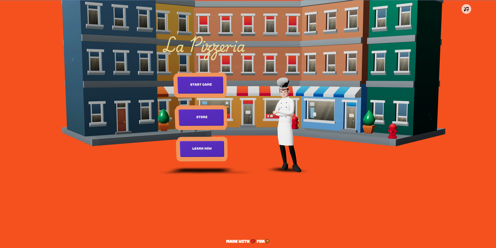
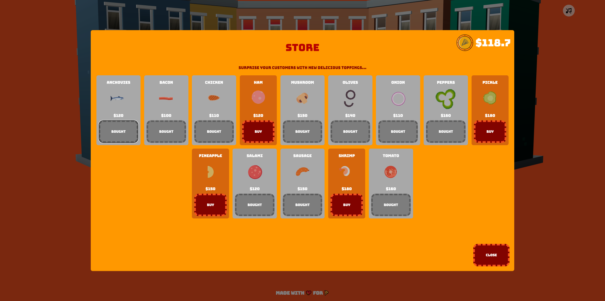
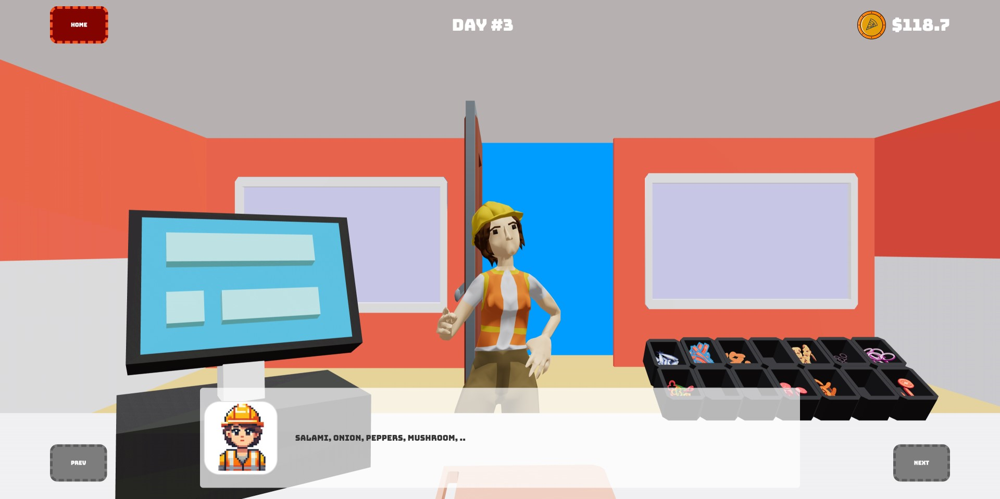
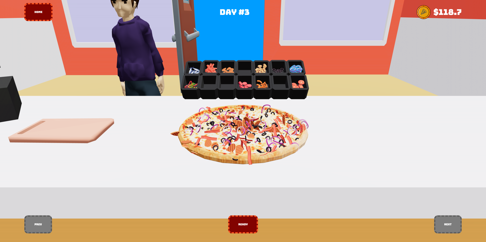
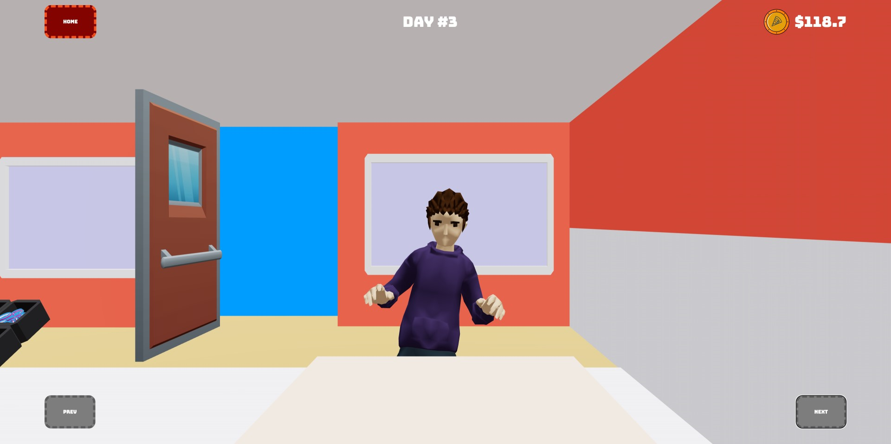

# La Pizzeria Game

Welcome to the **La** **Pizzeria Game**! This is an **interactive 3D mobile/web game** built using **[React Native](https://reactnative.dev/)** and **[React Three Fiber (R3F)](https://github.com/pmndrs/react-three-fiber)** with physics powered by **[Cannon-ES](https://github.com/pmndrs/cannon-es)**. In this game, players create custom pizzas with a variety of toppings according to (or in spite of) the customer's order. Depending on the customer's rating of your unique creation.

**BEWARE:** The customers might have weirder taste than you and me, or have a very unique palate let's say, so expect a lot of anchovies, pickles and pineapple pizza or similarly horrendous combinations.

## Features

### 1. **Interactive Toppings Selection**

A pizza wouldn't be pizza without toppings (except margarita and quattro formaggi). We have 14 toppings in the store, you start with 5 classic toppings: bacon, mushroom, olive, onion and pepper. The rest is up to you. You can extend your topping selection by buying new toppings from store with your earnings at the end of day.

### 2. **Customer Orders**

Customer orders are randomly generated with respect to your available toppings selection. This part of the game also serves as a simple short term memory exercis. You can customize your pizza as your heart desires or as the customer desires, the choice is yours. However, beware that sad customers will lower your daily rating.

### 3. **Physics**

Physics is a key part of the game, powered by  **Cannon-ES** . Each topping added to the pizza interacts with the pizza base using realistic physics simulations. Due to limited worker thread support in React Native, a single thread physics engine like Cannon-ES was used. This introduces **a challenge for optimization** as the main thread should not be blocked by the physics engine. To achieve this, while maintaining 60 FPS on mid-tier mobile device, some rendering strategies and optimizations are used. Next chapter mentions some of these strategies.

## Challenges & Optimization Strategies

One of the major focuses of this project was optimizing for performance, especially for mobile devices, where resources are limited. Even though React Native is amazing, it is still missing a multit-threaded physics engine, which kinda blocks developing more complex games on it. Keeping the main thread as idle as possible is something always desirable, especially if the physics engine is also running on it and you might be drawing up to 2 million triangles on the screen. 

### **1. Merging Toppings into a Single Mesh**

Instead of rendering each topping individually, all toppings are merged into a single mesh with a **texture atlas**. The vertex shader selectively draws only the appropriate topping based on an material attribute, reducing the number of draw calls from a max of 14 to 1. This drastically cuts down on the rendering cost and improves performance on low-end devices.

### **2. Instanced Mesh with Physics**

The game uses i**nstanced meshes** for toppings, where multiple instances of the same topping are created without increasing the draw calls. We also implemented **Cannon-ES** for physics simulation. Each topping uses its own physics body, but the position and rotation are synchronized with the instance matrices efficiently.

Physics calculations are optimized by removing physics bodies when they become static or go to sleep. We ensure that physics updates only happen when needed to not keep the main thread busy for non-moving rigid bodies.

### **3. Optimized Shader**

The toppings use a **custom shader** to access a **4x4 texture atlas**. This shader checks the UV coordinates of the vertices and decides which portions of the texture atlas to draw. This allows us to combine the textures of all toppings into one and still maintain the visual distinction between different toppings and different color variants (red, green, yellow pepper).

### **4. Handling Large Number of Toppings**

The game is prepared to handle up to **2000 toppings** efficiently. Yes, it's a bit much but test devices still maintained 60 FPS, so go for it and let me know by creating an issue 😁. We pre-allocate the memory for these instances and manage physics bodies dynamically. We handle additions and removals of toppings without constantly reallocating or copying entire arrays of data.

## Installation (or see live demo)

1. Clone the repository:

   ```
   git clone https://github.com/berke-bakar/la-pizzeria-game
   ```
2. Open the directory in terminal and install dependencies with:

   ```
   npm install
   ```
3. Run the development server:

   ```
   npm start
   ```
4. To test on your device:

* **For Android/iOS:** Use the Expo Go app and scan the QR code that appears when you start the development server.
* **For Web:** Open the project in your preferred browser by visiting the url printed in the Expo CLI. Usually `http://localhost:8081`

## Basic Controls

* **Toppings Selection:** Tap or click on the topping containers to add toppings to your pizza.
* **Make Pizza:** Follow the customer's order and place the right toppings on the pizza. Or make them cry creating exact opposite.
* **Delivery:** Once the pizza is made, deliver it to the customer, watch their reaction and prepare for the next one, the day is not over yet.

## Screenshots












## Attributions

* All models are edited to simplify and reduce the draw call count, sound effects are edited by me to reduce file size.

**Models**

* Oven by Ian MacGillivray [CC-BY] (https://creativecommons.org/licenses/by/3.0/) via Poly Pizza (https://poly.pizza/m/5A5gCGdExp_)
* Lunch Counter by Alan Zimmerman [CC-BY] (https://creativecommons.org/licenses/by/3.0/) via Poly Pizza (https://poly.pizza/m/8qkXF9-Ge7Y)
* Pepperoni pizza by Poly by Google [CC-BY] (https://creativecommons.org/licenses/by/3.0/) via Poly Pizza (https://poly.pizza/m/9IWGn64Fnqo)
* Suit by Quaternius [CC-BY] (https://creativecommons.org/licenses/by/3.0/) via Poly Pizza (https://poly.pizza/m/sOUciDsoVV)
* Worker by Quaternius [CC-BY] (https://creativecommons.org/licenses/by/3.0/) via Poly Pizza (https://poly.pizza/m/E8079Ahx7k)

**Sounds**

* Game music by Matthew Pablo: [https://matthewpablo.com/services/](https://matthewpablo.com/services/)
* Sound effects taken from [ZapSplat ](https://www.zapsplat.com)and [Apple Hill Studios](https://www.soundsnap.com/user-name/apple_hill_studios):
  * Oven: https://zapsplat.com/music/microwave-oven-on-run-off-30-seconds/
  * Pizza Box Closing: https://www.zapsplat.com/music/cardboard-pizza-box-lid-close/
  * Pizza Base Drop: https://www.zapsplat.com/music/basketball-ball-bounce-x1-on-grass-1/
  * Door: https://www.zapsplat.com/music/bedroom-door-open-2/
  * Walking: https://www.zapsplat.com/music/footsteps-leather-boots-walk-on-concrete-3/
  * Screaming: https://www.zapsplat.com/music/female-scream-2/
